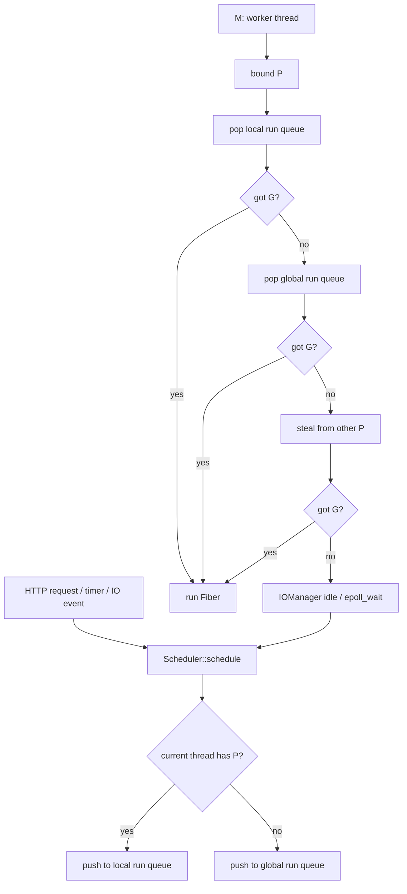

# 基于 Go GMP 思想改造 C++ 协程调度器计划

> 本文档是 GMP 调度器改造过程中的计划和历史记录。
> 当前最终整理版请优先阅读 `docs/GMP_IMPLEMENTATION_SUMMARY.md`；
> 当前压测数据请阅读 `docs/BENCHMARK_RESULTS.md`。

## 1. 目标定位

本项目当前已经具备 C++ 用户态协程、线程池调度、epoll 事件驱动、阻塞 IO hook、HTTP 服务、文件上传下载、FastDFS 存储和 MySQL 元数据管理能力。

本次改造目标不是完整复刻 Go runtime，而是在现有协程框架上实现一个可运行、可讲清楚、可压测的简化版 GMP 调度模型，用于支撑高并发云存储系统。

推荐项目表述：

> 基于 C++ 协程调度器的高并发云存储系统：借鉴 Go GMP 的异步 IO 调度模型

不建议直接表述为：

> C++ 完整实现 Go GMP 调度器

原因是 Go runtime 的 GMP 还包含抢占式调度、系统调用阻塞解绑、GC 协作、完整 netpoller 状态机等复杂机制，当前项目没有必要全部实现。

## 2. 当前调度器现状

当前核心文件：

- `FiberServer/fiber.h`
- `FiberServer/fiber.cpp`
- `FiberServer/scheduler.h`
- `FiberServer/scheduler.cpp`
- `FiberServer/iomanager.h`
- `FiberServer/iomanager.cpp`
- `FiberServer/hook.h`
- `FiberServer/hook.cpp`

当前模型可以概括为：

- `Fiber`：用户态协程，基于 `ucontext` 保存和恢复上下文。
- `Thread`：执行协程调度循环的工作线程。
- `Scheduler`：维护一个全局任务队列 `m_fibers`，多个线程从该队列中取任务执行。
- `IOManager`：继承 `Scheduler`，基于 `epoll` 管理 socket 读写事件，并在事件就绪时重新调度协程。
- `hook`：拦截 `read/write/accept/connect/sleep` 等阻塞调用，把阻塞等待转成协程让出和 epoll 事件恢复。

当前模型已经适合描述为：

> C++ 用户态协程 + 多线程调度 + epoll 异步 IO

但还不能严格称为 Go GMP，因为它缺少显式的 `P` 抽象、本地运行队列、work stealing 和全局/本地队列协同策略。

## 3. 简化版 GMP 对应关系

计划中的对应关系：

| Go GMP 概念 | 本项目改造对象 | 说明 |
| --- | --- | --- |
| G | `Fiber` | 用户态协程，表示一个可调度任务 |
| M | `Thread` | OS 线程，实际执行协程 |
| P | 新增 `Processor` | 调度处理器，持有本地运行队列 |
| global run queue | `Scheduler` 全局队列 | 外部提交任务、负载兜底 |
| local run queue | `Processor::run_queue` | 每个 P 私有任务队列 |
| netpoll | `IOManager + epoll` | IO 就绪后把协程重新放回调度队列 |
| blocking syscall handling | `hook.cpp` | 把阻塞 IO 转成协程挂起和事件唤醒 |

## 4. 改造范围

本次建议实现：

- 新增 `Processor` 抽象。
- 每个 `Processor` 维护本地协程队列。
- 每个工作线程运行时绑定一个 `Processor`。
- `schedule()` 优先向当前线程绑定的 `Processor` 本地队列投递任务。
- 无本地 `Processor` 时投递到全局队列。
- 调度循环取任务顺序改为：本地队列 -> 全局队列 -> steal 其他 P -> idle。
- `IOManager` 的 epoll 事件恢复协程时，复用新的调度入口。
- 增加调度统计信息，便于压测和答辩展示。

本次不建议实现：

- Go 级别的抢占式调度。
- GC 协作和 safepoint。
- 系统调用阻塞时完整解绑 M/P。
- 完整复刻 Go netpoller。
- 跨平台 IOCP/kqueue 支持。
- 复杂优先级调度。

## 5. 目标架构



## 6. 分阶段实施计划

### 阶段一：补充调度设计文档和基准测试

目标：先固定设计边界，避免直接改核心调度器导致定位困难。

任务：

- 梳理当前 `Scheduler::schedule()`、`Scheduler::run()`、`IOManager::idle()` 的调用关系。
- 补充当前调度模型说明图。
- 增加最小调度测试：单线程、多线程、多协程 yield、定时器唤醒、socket IO 唤醒。
- 跑一次当前版本的 HTTP 压测，记录基线数据。

验收标准：

- 能说明当前调度器如何从全局队列取任务。
- 能说明 IO 事件如何唤醒协程。
- 有一组改造前基准数据，作为后续对比。

### 阶段二：新增 Processor 抽象

目标：引入 GMP 中的 `P`，但暂时不大改调度行为。

建议新增结构：

```cpp
struct Processor {
    int id = -1;
    Mutex mutex;
    std::deque<FiberAndThread> run_queue;
    std::atomic<size_t> schedule_count{0};
    std::atomic<size_t> steal_count{0};
};
```

任务：

- 在 `Scheduler` 中增加 `std::vector<std::unique_ptr<Processor>> m_processors`。
- 增加线程局部变量 `thread_local Processor* t_processor`。
- 在线程进入 `Scheduler::run()` 时绑定一个 `Processor`。
- 暂时保留原全局队列，确保功能不变。

验收标准：

- 每个工作线程能拿到自己的 `Processor`。
- 原 HTTP server、上传下载流程仍能启动。
- 原有调度测试不回退。

### 阶段三：改造 schedule 投递策略

目标：让任务优先进入本地队列，而不是全部进入全局队列。

策略：

- 当前线程已经处于某个 `Scheduler` 且绑定了 `Processor`：投递到当前 P 的本地队列。
- 当前线程没有绑定 P：投递到全局队列。
- 指定线程任务 `thread != -1`：先保持全局队列逻辑，避免破坏现有指定线程语义。
- IOManager 从 epoll 恢复协程时，仍调用统一 `schedule()`，由调度器决定进入本地还是全局。

验收标准：

- 普通任务可以进入本地队列。
- 外部线程投递任务可以进入全局队列。
- 指定线程任务行为不变。
- 空闲线程能被 `tickle()` 唤醒。

### 阶段四：改造 run 取任务策略

目标：实现简化 GMP 的核心调度顺序。

新的取任务顺序：

1. 当前 P 本地队列。
2. Scheduler 全局队列。
3. 从其他 P 的本地队列 steal。
4. 没任务则进入 idle。

work stealing 简化策略：

- 当前 P 本地队列为空时，遍历其他 P。
- 从目标 P 队列尾部偷取一半任务，或者至少偷取一个任务。
- 当前线程先执行偷到的第一个任务，其余放入当前 P 本地队列。
- steal 操作需要加目标 P 的队列锁，避免和对方线程并发冲突。

验收标准：

- 多线程下任务能均匀分布。
- 某个 P 队列堆积时，其他空闲 P 能偷取任务。
- 没有明显死锁、任务丢失、重复执行。
- 调度器停止条件仍正确。

### 阶段五：接入 IOManager 和 hook 验证

目标：保证 GMP 化后不会破坏异步 IO。

重点检查：

- `IOManager::addEvent()` 保存的 `Scheduler*` 是否仍然正确。
- `FdContext::triggerEvent()` 调用 `schedule()` 后任务能进入合理队列。
- `hook.cpp` 中 `YieldToHold()` 后能被 timer 或 epoll 事件恢复。
- `IOManager::idle()` 中 `epoll_wait` 和调度队列唤醒没有竞态。

验收标准：

- `sleep/usleep/nanosleep` hook 正常。
- socket accept/read/write hook 正常。
- HTTP server 能正常处理并发请求。
- 上传、下载、文件列表接口不因调度改造出现挂起。

### 阶段六：增加调度观测能力

目标：让 GMP 改造能展示出来，而不是只停留在代码层。

建议增加统计项：

- 每个 P 的本地队列长度。
- 每个 P 执行任务数量。
- 每个 P steal 成功次数。
- 全局队列长度。
- 活跃线程数、空闲线程数。
- epoll 唤醒次数。

展示方式：

- 日志输出。
- `/api/status` 接口返回 JSON。
- 压测结束后打印调度统计。

验收标准：

- 能看到任务主要从本地队列执行。
- 能看到 work stealing 发生。
- 能用数据说明调度器改造效果。

### 阶段七：压测和论文/简历包装

目标：把技术改造沉淀成可展示成果。

压测维度：

- 线程数：1、2、4、8。
- 并发数：100、500、1000、2000。
- 接口：登录、文件列表、小文件上传、大文件分片上传、下载。
- 指标：QPS、平均延迟、P95、P99、错误率、CPU 占用。

建议输出：

- 改造前后对比表。
- GMP 简化模型架构图。
- 调度流程图。
- 核心代码说明。
- 与 Go GMP 的相同点和差异点。

## 7. 风险点

### 7.1 调度器停止条件更复杂

当前 `stopping()` 只检查全局队列和活跃线程数。新增本地队列后，必须同时检查所有 P 的本地队列是否为空。

否则可能出现：

- 本地队列还有任务但调度器提前停止。
- 某些线程一直 idle，任务无法被执行。

### 7.2 tickle 唤醒策略需要调整

当前 `schedule()` 判断全局队列是否为空来决定是否 tickle。新增本地队列后，tickle 条件要考虑：

- 是否存在空闲线程。
- 是否任务投递到了非当前 P。
- 是否任务投递到了全局队列。

### 7.3 指定线程任务语义容易被破坏

当前 `FiberAndThread::thread` 支持指定线程执行。引入 P 后不能简单把所有任务塞到本地队列，否则指定线程任务可能被错误线程执行。

建议第一版保守处理：指定线程任务继续走全局队列，并在取任务时检查线程 id。

### 7.4 IOManager idle 和 work stealing 的边界

`IOManager::idle()` 负责 `epoll_wait`，如果取任务逻辑和 idle 边界处理不好，可能出现：

- 线程睡进 epoll，但本地队列有任务。
- epoll 唤醒后任务被放入队列但没有线程处理。
- timer 回调延迟过大。

### 7.5 代码侵入性较高

核心改动集中在 `Scheduler`，而 `IOManager`、`hook`、HTTP server 都依赖它。建议每个阶段都保持可编译、可运行，不要一次性大改。

## 8. 推荐实现顺序

优先级从高到低：

1. 写调度测试和当前基线。
2. 新增 `Processor`，只绑定线程，不改变行为。
3. 本地队列投递。
4. 本地队列取任务。
5. 全局队列兜底。
6. work stealing。
7. 修改 `stopping()` 和 `tickle()`。
8. 接入调度统计。
9. 压测和文档包装。

## 9. 最小可交付版本

如果时间紧，最小版本只做这些：

- `Fiber = G`
- `Thread = M`
- `Processor = P`
- 每个 P 一个本地队列
- 本地队列优先调度
- 全局队列兜底
- 简单 work stealing
- `IOManager + epoll` 作为 netpoll 简化实现
- 文档明确说明与 Go GMP 的差异

这个版本已经足够支撑项目亮点：

> 在 C++ 云存储系统中实现了借鉴 Go GMP 思想的 M:N 协程调度器，通过本地队列、全局队列、work stealing 和 epoll 事件唤醒提升高并发 IO 场景下的任务调度能力。

## 10. 预计工作量

| 任务 | 预计时间 |
| --- | --- |
| 阅读和补测试 | 0.5 - 1 天 |
| 新增 Processor | 0.5 天 |
| 改造 schedule 和 run | 1 - 2 天 |
| work stealing | 1 天 |
| IOManager/hook 联调 | 1 - 2 天 |
| 状态统计和文档 | 0.5 - 1 天 |
| 压测和问题修复 | 1 - 3 天 |

整体预计：

- 可讲的最小版本：3 - 7 天。
- 比较稳的版本：1 - 2 周。
- 接近 Go runtime 完整度：不建议作为当前项目目标。

## 11. 结论

这个方向值得做，但目标要控制在“借鉴 Go GMP 的 C++ 协程调度模型”。这样既能体现底层能力，又能服务云存储业务，不会把项目拖进完整 runtime 实现的深坑。

下一步建议先完成阶段一：给当前调度器补测试和基线压测，再开始引入 `Processor`。

## 12. 当前执行状态

更新时间：2026-06-11

已完成最小实现：

- 在 `FiberServer/scheduler.h` 中新增 `Processor` 抽象。
- 每个 `Processor` 持有一个本地运行队列 `run_queue`。
- `Scheduler` 初始化时按照参与调度的线程数量创建 `Processor`。
- 工作线程进入 `Scheduler::run()` 时绑定一个 `Processor`。
- `schedule()` 在当前线程已绑定本调度器 `Processor` 且没有指定线程时，优先把任务放入当前 P 的本地队列。
- 外部线程投递任务、指定线程任务继续进入全局队列 `m_fibers`。
- `Scheduler::run()` 的取任务顺序已改为：本地队列 -> 全局队列 -> 从其他 P steal -> idle。
- 已实现简单 work stealing：当前 P 无任务时，从其他 P 的本地队列尾部偷取一个可运行任务。
- work stealing 已升级为批量偷取：当前 P 无任务时，从目标 P 队尾偷取约一半可运行任务，当前线程立即执行其中一个，其余放入当前 P 本地队列。
- work stealing 已增加轮转 victim 起点，避免每次从同一个 P 开始扫描；同时新增 steal 尝试次数和失败次数统计。
- 全局队列取任务已升级为批量搬运：当前 P 从全局队列获取一个可执行任务后，会额外搬运一批普通任务到当前 P 本地队列，减少全局队列锁竞争。指定线程任务仍保留全局队列语义。
- `Mutex::Lock` 析构已改为通过 `unlock()` 按状态释放，避免手动提前解锁后析构二次 unlock。
- `Scheduler::popGlobalTask()` 已改为作用域管理全局锁，批量搬运任务时不再依赖手动提前释放 RAII 锁。
- 已删除误拼且未引用的空头文件 `FiberServer/servlets/statuc_servlet.h`。
- `stopping()` 已改为同时检查全局队列、所有 P 的本地队列和活跃线程数。
- 已新增调度统计快照 `Scheduler::getStats()` 和 `Scheduler::dump()`，可查看全局队列长度、全局投递次数、活跃/空闲线程数、各 P 本地队列长度、本地投递次数、执行次数和 steal 次数。
- 调度统计已细分执行来源：`local_execute_count`、`global_execute_count`、`steal_execute_count`，并新增 `global_pull_count`、`global_batch_count`、`steal_batch_count`、`steal_attempt_count`、`steal_fail_count`。
- 已新增 `/api/status` 状态接口，运行中的 HTTP 服务可返回当前调度器统计 JSON。
- `FiberServer/tests/test.cpp` 新增 `test_gmp_scheduler()`，用 200 个协程任务和 `YieldToReady()` 验证 READY 协程重新调度。
- `test_gmp_scheduler()` 已增加统计断言，验证外部任务进入全局队列、READY 协程回到本地队列、任务执行计数符合预期。
- 已新增 `test_gmp_batch_stealing()`，构造单 P 本地队列堆积场景，验证其他 P 能批量 steal 并执行偷取任务。
- 已新增 `test_iomanager_sleep_timer()`，验证 `usleep` hook 通过 `IOManager` timer 恢复协程，且恢复任务进入本地调度队列。
- 已新增 `test_iomanager_socket_hook()`，用本机 TCP 回环连接验证 `connect/accept/read/write` hook 通过 epoll 恢复协程。

本次改动涉及文件：

- `FiberServer/scheduler.h`
- `FiberServer/scheduler.cpp`
- `FiberServer/servlets/status_servlet.h`
- `FiberServer/servlets/status_servlet.cpp`
- `FiberServer/servlets/all_servlet.h`
- `FiberServer/net/http/http_server.cpp`
- `FiberServer/my/application.cpp`
- `FiberServer/base/mutex.h`
- `FiberServer/tests/test.cpp`
- `scripts/docker_bench.sh`
- `scripts/docker_bench_business.sh`
- `scripts/docker_bench_matrix.sh`
- `docker-compose.dev.yml`
- `docker/config.docker.yml`
- `config.txt`
- `CMakeLists.txt`
- `plans/gmp-scheduler-plan.md`
- 删除 `FiberServer/servlets/statuc_servlet.h`

当前验证结果：

- 已安装并启动 Docker Desktop，使用 WSL2 backend。
- 已新增 WSL2 + Docker Compose 开发环境，详见 `docs/WSL2_DOCKER.md`。
- 已通过 `docker compose -f docker-compose.dev.yml config` 校验 compose 配置。
- 已成功构建 `fiberserver-dev:local` 开发镜像，镜像内从源码构建 `libfastcommon`、`libserverframe` 和 `fastdfs`。
- 已运行 `scripts/docker_test.sh` 对等命令完成 Linux 容器内编译和测试。
- 最新 `./build/test` 已通过，输出 `gmp scheduler test passed: 200 tasks, local_scheduled=200, executed=400, global_pulled=200, global_batches=30`。
- 最新 `./build/test` 已通过，输出 `gmp batch stealing test passed: stolen=198, steal_batches=18, steal_executed=18, steal_attempts=43, steal_fails=25`。
- 最新 `./build/test` 已通过，输出 `iomanager sleep timer test passed: local_scheduled=2, executed=3`。
- 最新 `./build/test` 已通过，输出 `iomanager socket hook test passed: local_scheduled=14, executed=15`。
- 源码精简后重新运行容器内编译和测试通过，最新输出包括 `gmp scheduler test passed`、`gmp batch stealing test passed`、`iomanager sleep timer test passed`、`iomanager socket hook test passed`。
- 已强制重建并重启 `fiberserver-app`，请求 `http://localhost:8080/api/status` 返回 `HTTP/1.1 200 OK`，响应中包含 `global_queue_size`、`global_schedule_count`、`active_thread_count`、`idle_thread_count` 和每个 P 的 `queue_size/schedule_count/execute_count/steal_count`。
- 最新 `/api/status` 已包含每个 P 的 `local_execute_count/global_execute_count/steal_execute_count/global_pull_count/global_batch_count/steal_batch_count/steal_attempt_count/steal_fail_count`。
- 已启动 `mysql`、`fastdfs-tracker`、`fastdfs-storage` 依赖服务，其中 MySQL 宿主机端口为 `localhost:3307`，容器内部仍是 `mysql:3306`。
- 已启动 `fiberserver-app`，服务监听 `http://localhost:8080`。
- 已请求 `http://localhost:8080/api/_/config`，返回 `HTTP/1.1 200 OK`，确认应用能加载 `docker/config.docker.yml` 并对外响应。
- 已新增 `scripts/docker_e2e.sh`，并验证注册、登录、直传上传、文件列表、下载响应头和 Nginx 完整下载主链路。
- 已运行 Compose 网络内端到端脚本，覆盖 `/api/status`、注册、登录、直传上传、分片上传、文件列表、Nginx 完整下载内容比对，输出 `e2e passed`。
- 已新增 `scripts/docker_bench.sh` 轻量压测脚本，使用 Python 标准库并发请求 HTTP 接口并输出 QPS、平均延迟、P50/P95/P99。
- 已在 Compose 网络内运行 `/api/status` 小样本基线：100 请求、10 并发、全部返回 200，QPS 约 765，P95 约 19ms。
- 已新增 `scripts/docker_bench_business.sh` 业务压测脚本，自动准备测试用户和样例文件，覆盖 `status/login/myfiles/download/direct_upload`。
- 已在 Compose 网络内运行业务小样本基线：30 请求、5 并发下 `status/login/myfiles/download` 全部 0 错误；直传上传 5 请求、2 并发全部 0 错误。
- 已新增 `scripts/docker_bench_matrix.sh` 矩阵压测入口，支持 `REQUESTS_LIST` 和 `CONCURRENCY_LIST` 循环运行业务压测。
- 已在 Compose 网络内运行小矩阵验证：`REQUESTS_LIST="10 20"`、`CONCURRENCY_LIST="1 5"`、`UPLOAD_REQUESTS=2`、`UPLOAD_CONCURRENCY=1`，多轮业务压测全部 0 错误。
- 已新增服务线程数配置 `server.worker_threads`，默认值为 5，保持原运行行为。
- 已新增环境变量覆盖 `FIBER_WORKER_THREADS`，方便重启服务时测试不同线程数。
- 已验证 `FIBER_WORKER_THREADS=2` 生效，`/api/status` 显示 2 个 Processor；验证后已恢复默认 5 线程运行状态。
- `FiberServer/util/hash_util.cpp` 的 OpenSSL 3.0 HMAC deprecation warnings 已处理，并补充 HMAC 标准向量测试。

后续优先事项：

1. 使用 `FIBER_WORKER_THREADS=1/2/4/8` 重启服务，配合 `scripts/docker_bench_matrix.sh` 记录多线程和多并发组合数据。
2. 继续补更长时间业务压测和更大的上传样本，确认当前短样本结果能否稳定复现。
