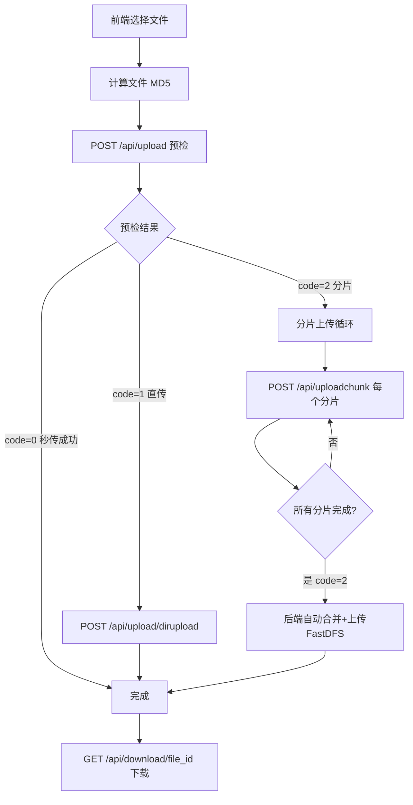

# FiberServer 文件上传/秒传/分片上传/下载 实现计划

> 本文档是上传下载链路实现过程中的计划和问题记录。
> 当前运行、验证和压测入口请优先阅读 `docs/README.md`。

## 现状分析

### 已有功能（基本框架已搭建，但存在 Bug）
- `/api/upload` - 预检 Servlet（秒传/直传/分片判断）
- `/api/upload/dirupload` - 小文件直传 Servlet
- `/api/uploadchunk` - 分片上传 Servlet
- `/api/md5` - 秒传 Servlet（**未注册路由**）
- `/api/myfiles` - 文件列表 Servlet

### 缺失功能
- `/api/download/*` - **下载文件 Servlet 完全缺失**

### 关键 Bug

1. **`CreateFile` 调用参数错误** - `chunkupload_servlet.cpp:62` 和 `dirupload_servlet.cpp:54` 都把 `username` 当作 `file_id` 传入，签名是 `CreateFile(db, md5, file_id, url, size, type)` 但调用是 `CreateFile(mysql, md5, username, file_id, size, type)`（多了一个参数）
2. **DirUploadServlet 解析方式错误** - 前端发送 `FormData`（multipart），但后端用 `JsonUtil::FromString` 解析 JSON
3. **Md5Servlet 未注册路由** - 存在但未在 `http_server.cpp` 中添加
4. **MyFilesServlet 不按用户过滤** - 查询所有文件而非当前用户的文件
5. **ChunkUploadServlet 的分片上传** - Nginx 通过 `client_body_in_file_only` 落盘后传 `X-File-Path`，但前端分片上传时发送的是 FormData 包含 JSON 字段，后端却从 body 解析 JSON

## 架构流程



## 数据库表结构

现有 `file_info` 表字段：`id, md5, file_id, url, size, type, count, create_time, update_time`

需要新增 `user_file_list` 表来关联用户和文件：
```sql
CREATE TABLE IF NOT EXISTS user_file_list (
    id BIGINT AUTO_INCREMENT PRIMARY KEY,
    user VARCHAR(128) NOT NULL,
    md5 VARCHAR(128) NOT NULL,
    file_name VARCHAR(256) NOT NULL,
    file_id VARCHAR(256) NOT NULL,
    shared_status TINYINT DEFAULT 0,
    pv INT DEFAULT 0,
    create_time TIMESTAMP DEFAULT CURRENT_TIMESTAMP,
    update_time TIMESTAMP DEFAULT CURRENT_TIMESTAMP ON UPDATE CURRENT_TIMESTAMP,
    INDEX idx_user (user),
    INDEX idx_md5 (md5)
);
```

## 实施步骤

### 第一阶段：修复现有 Bug

1. **修复 DirUploadServlet** - 改为从 Nginx 落盘的 `X-File-Path` 读取文件内容（与 ChunkUploadServlet 类似），或改为正确解析 multipart FormData
2. **修复 ChunkUploadServlet** - 从 `X-File-Path` header 读取 Nginx 落盘的分片文件，从 URL query 或 FormData 字段获取元数据（md5, chunk_index 等）
3. **修复 CreateFile 调用** - 在 `chunkupload_servlet.cpp` 和 `dirupload_servlet.cpp` 中修正参数顺序
4. **注册 Md5Servlet 路由** - 在 `http_server.cpp` 中添加 `/api/md5`

### 第二阶段：新增下载功能

5. **创建 DownloadServlet** - 新建 `download_servlet.h/cpp`，处理 `GET /api/download/*` 请求
   - 从 URL 路径提取 `file_id`
   - 查询 MySQL 获取文件信息
   - 通过 FastDFS 下载文件内容
   - 设置正确的 Content-Type 和 Content-Disposition header
   - 返回文件二进制数据
6. **注册下载路由** - 在 `http_server.cpp` 中添加 glob 路由 `/api/download/*`
7. **更新 Nginx 配置** - 添加 `/api/download/` 的 proxy_pass 规则

### 第三阶段：完善用户文件关联

8. **新增 user_file_list 数据库操作** - 在 `mysqlop.h/cpp` 中添加用户文件关联的 CRUD
9. **修复 MyFilesServlet** - 按用户名查询文件列表
10. **修复 UploadServlet 预检** - 秒传时同时检查用户是否已有此文件
11. **上传成功后写入 user_file_list** - 在 DirUploadServlet 和 ChunkUploadServlet 中，上传成功后同时写入用户文件关联

### 第四阶段：前端适配

12. **修复前端分片上传** - 确保 FormData 字段名与后端解析一致
13. **确保下载按钮正确调用** - `/api/download/{file_id}` 路径正确

### 第五阶段：构建验证

14. **更新 CMakeLists.txt** - 添加新的 servlet 源文件
15. **编译测试** - 确保项目编译通过
16. **重启 Nginx** - 应用新配置

## 当前执行状态

更新时间：2026-06-11

当前代码相对本文档最初状态已经前进，旧的“未注册/缺失”判断需要以代码为准：

- `/api/md5` 已在 `FiberServer/net/http/http_server.cpp` 注册。
- `/api/download` 已在 `FiberServer/net/http/http_server.cpp` 注册为 glob servlet。
- `DirUploadServlet` 当前从 query 读取元数据，从 request body 读取文件内容。
- `ChunkUploadServlet` 当前要求 `X-File-Path`，并支持从 query/header 读取分片元数据。
- `MyFilesServlet` 当前按用户名查询文件列表，`file_info.url` 字段存用户名。
- `file_info::CreateFile` 当前签名包含 `md5, file_id, username, filename, size, type`，直传和分片上传已按该签名写入记录。

本次修复：

- 修复新注册用户无法登录的问题：`user_info.status` 建表默认值改为 `1`。
- `user_info::CreateUser()` 显式写入 `status=1`，兼容已有旧数据库卷中默认值仍为 `0` 的情况。
- 新增 `scripts/docker_e2e.sh`，覆盖注册、登录、上传预检、小文件直传、文件列表和下载响应头验证。
- `scripts/docker_e2e.sh` 已扩展覆盖 `/api/status`、大文件分片上传、分片合并、FastDFS 上传、文件列表和 Nginx 完整下载内容比对。
- `docker/nginx.conf` 新增 `/group1/` 内部转发，支持 FiberServer 返回 `X-Accel-Redirect` 后由 Nginx 从 FastDFS storage 拉取文件内容。
- `scripts/docker_e2e.sh` 支持 `DOWNLOAD_BASE_URL`，可通过 Nginx 验证完整下载内容。

已验证结果：

- Docker 环境下新注册用户登录返回 `code=0`。
- 上传预检小文件返回 `code=1`。
- `/api/upload/dirupload` 返回 `code=0`，文件写入 FastDFS，并在 MySQL `file_info` 中出现。
- `/api/myfiles` 能列出刚上传的文件和 `file_id`。
- `/api/download?user=...&filename=...` 返回 `HTTP 200`，并包含 `X-Accel-Redirect` 和 `Content-Disposition`。
- 通过 `DOWNLOAD_BASE_URL=http://nginx` 运行 `scripts/docker_e2e.sh` 已验证下载内容与上传内容一致。
- 通过 `BASE_URL=http://fiberserver-app:8080 DOWNLOAD_BASE_URL=http://nginx` 在 Compose 网络内运行 `scripts/docker_e2e.sh` 已验证分片上传主链路：上传预检返回 `code=2`，分片逐个上传，最后一个分片返回 `code=2`，文件出现在 `/api/myfiles`，经 Nginx 下载后与原始 6MB+ 文件一致。

后续仍需处理：

1. 分片上传依赖 `X-File-Path`，生产路径仍需要补 Nginx 落盘上传配置或改造为直接解析 body。
2. 可以继续补 wrk 或 ab 压测记录，形成调度器改造前后对比数据。
